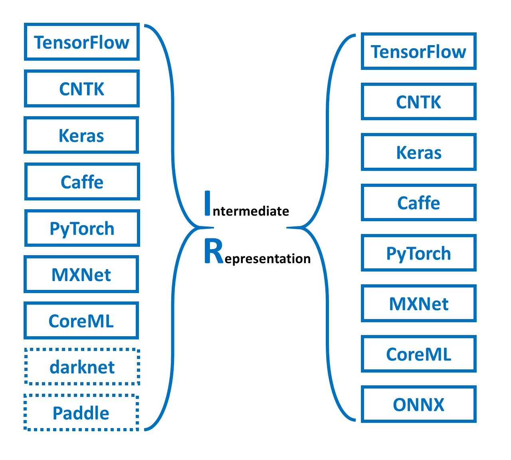
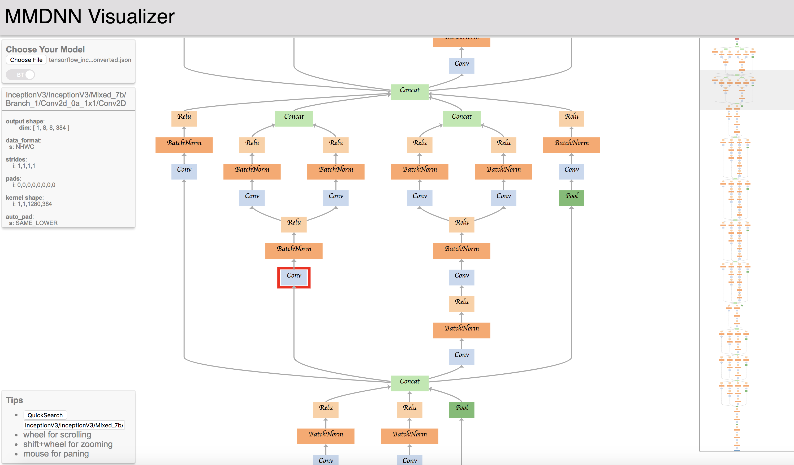
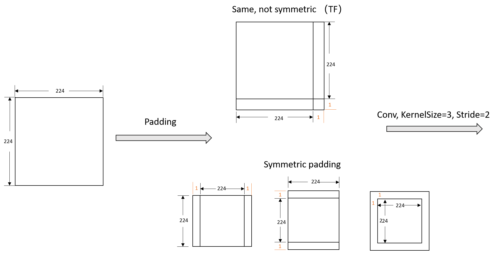

# MMdnn: 实现多个框架之间的模型转换

在深度学习领域，有许多深度学习框架可以让开发者和研究者用于设计模型，每个框架具备各自独特的网络结构定义和模型保存格式。AI工程师和研究者希望自己的模型能够在不同的框架之间转换，但框架之间的差距阻碍了模型之间的交互操作。


>微软开源 MMdnn，可用于转换、可视化和诊断深度神经网络模型的全面、跨框架解决方案，目前支持 Caffe、Keras、MXNet、Tensorflow、Pytorch、 CNTK 等框架。

MMdnn 是一个用于转换、可视化和诊断深度神经网络模型的综合性、跨框架的解决方案。MMdnn 中的 `MM` 代表模型管理，`dnn` 是 `deep neural network`（深度神经网络）的缩写。


MMdnn 可将一个框架训练的 DNN 模型转换到其他框架可用。其主要特征包括：

- 模型文件转换器，转换 DNN 模型使之适合不同框架

- 模型代码块生成器，生成适合不同框架的训练或推断代码块

- 模型可视化，针对不同框架可视化 DNN 网络架构和参数

- 模型兼容性测试

### 安装

```
pip install https://github.com/Microsoft/MMdnn/releases/download/0.1.3/mmdnn-0.1.3-py2.py3-none-any.whl
```

### 模型转换

业界和学界存在大量现有框架，适合开发者和研究者来设计模型，每个框架具备自己的网络结构定义和模型保存格式。框架之间的差距阻碍了模型的交互操作。

<div align="center">

</div>

我们提供一个模型转换器，帮助开发者通过中间表征格式转换模型，以适合不同框架。

### 支持框架

> 每个支持的框架都有详细的 README 文档，它们可以在以下conversion件夹找到。

- [Caffe](https://github.com/Microsoft/MMdnn/blob/master/mmdnn/conversion/caffe/README.md)
- [Microsoft Cognitive Toolkit (CNTK)](https://github.com/Microsoft/MMdnn/blob/master/mmdnn/conversion/cntk/README.md)
- [CoreML](https://github.com/Microsoft/MMdnn/blob/master/mmdnn/conversion/coreml/README.md)
- [Keras](https://github.com/Microsoft/MMdnn/blob/master/mmdnn/conversion/keras/README.md)
- [MXNet](https://github.com/Microsoft/MMdnn/blob/master/mmdnn/conversion/mxnet/README.md)
- [ONNX](https://github.com/Microsoft/MMdnn/blob/master/mmdnn/conversion/onnx/README.md) (Destination only)
- [PyTorch](https://github.com/Microsoft/MMdnn/blob/master/mmdnn/conversion/pytorch/README.md)
- [TensorFlow](https://github.com/Microsoft/MMdnn/blob/master/mmdnn/conversion/tensorflow/README.md) (Experimental) (We highly recommend you read the README of TensorFlow first)
- [DarkNet](https://github.com/Microsoft/MMdnn/blob/master/mmdnn/conversion/darknet/README.md) (Source only, Experiment)


#### Tested models

The model conversion between currently supported frameworks is tested on some **ImageNet** models.

Models | Caffe | Keras | TensorFlow | CNTK | MXNet | PyTorch  | CoreML | ONNX
:-----:|:-----:|:-----:|:----------:|:----:|:-----:|:--------:|:------:|:-----:|
[VGG 19](https://arxiv.org/abs/1409.1556.pdf) | √ | √ | √ | √ | √ | √ | √ | √
[Inception V1](https://arxiv.org/abs/1409.4842v1) | √ | √ | √ | √ | √ | √ | √ | √
[Inception V3](https://arxiv.org/abs/1512.00567)  | √ | √ | √ | √ | √ | √ | √ | √
[Inception V4](https://arxiv.org/abs/1512.00567)  | √ | √ | √ | o | √ | √ | √ | √
[ResNet V1](https://arxiv.org/abs/1512.03385)                               |   ×   |   √   |     √      |   o  |   √   |    √ | √ | √
[ResNet V2](https://arxiv.org/abs/1603.05027)                               |   √   |   √   |     √      |   √  |   √   | √ | √ | √
[MobileNet V1](https://arxiv.org/pdf/1704.04861.pdf)                        |   ×   |   √   |     √      |   o  |   √   |    √       | √ | √ | √
[MobileNet V2](https://arxiv.org/pdf/1704.04861.pdf)                        |   ×   |   √   |     √      |   o  |   √   |    √       | √ | √ | √
[Xception](https://arxiv.org/pdf/1610.02357.pdf)                            |   √   |   √   |     √      |   o  |   ×   |    √ | √ | √ | √
[SqueezeNet](https://arxiv.org/pdf/1602.07360)                              |   √   |   √   |     √      |   √  |   √   |    √ | √ | √ | √
[DenseNet](https://arxiv.org/abs/1608.06993)                                |   √   |   √   |     √      |   √  |   √   |    √       | √ | √
[NASNet](https://arxiv.org/abs/1707.07012)                                  |   x   |   √   |     √      |   o  |   √   | √ | √ | x
[ResNext](https://arxiv.org/abs/1611.05431)                                 |   √   |   √   |     √      |   √  |   √   | √ | √ | √ | √ | √
[voc FCN](https://people.eecs.berkeley.edu/~jonlong/long_shelhamer_fcn.pdf) |       |       |     √      |   √  |       |
[Yolov3]()                                                                       |       |   √   |            |   √  |


#### On-going frameworks

- Torch7 (help wanted)
- Chainer (help wanted)

#### On-going Models

- Face Detection
- Semantic Segmentation
- Image Style Transfer
- Object Detection
- RNN


### 模型可视化

你可以使用 MMdnn 模型可视化工具(http://vis.mmdnn.com/) 提交自己的 IR json 文件进行模型可视化。为了运行下面的命令行，你需要使用喜欢的包管理器安装 requests、Keras、TensorFlow。

使用 Keras inception_v3 模型作为示例。

1. 下载预训练模型：
```python
mmdownload -f keras -n inception_v3
```
2. 将预训练模型文件转换成中间表征格式：
```python
mmtoir -f keras -w imagenet_inception_v3.h5 -o keras_inception_v3
```
3. 打开 MMdnn 模型可视化工具地址（http://mmdnn.eastasia.cloudapp.azure.com:8080/），选择文件 keras_inception_v3.json。




### 中间表征
中间表征的网络结构以 `protobuf` 的二进制格式文件进行储存，模型预训练权重以 NumPy 格式中储存。
目前 IR 权重数据使用的是 NHWC 格式。中间表征的细节请查看 ops.txt 和 graph.proto 文件。


### 使用案例

以下是该项目实现框架转换的基本案例，其中包括官方的教程和用户提供的各种案例。

#### Official Tutorial

- [Keras "inception V3" to CNTK](https://github.com/Microsoft/MMdnn/blob/master/docs/keras2cntk.md) and [related issue](https://github.com/Microsoft/MMdnn/issues/19)

- [TensorFlow slim model "ResNet V2 152" to PyTorch](https://github.com/Microsoft/MMdnn/blob/master/docs/tf2pytorch.md)

- [Mxnet model "LResNet50E-IR" to TensorFlow](https://github.com/Microsoft/MMdnn/issues/85) and [related issue](https://github.com/Microsoft/MMdnn/issues/135)

#### Users' Examples

- [MXNet "ResNet-152-11k" to PyTorch](https://github.com/Microsoft/MMdnn/issues/6)

- [Another Example of MXNet "ResNet-152-11k" to PyTorch](https://blog.paperspace.com/convert-full-imagenet-pre-trained-model-from-mxnet-to-pytorch/)

- [MXNet "ResNeXt" to Keras](https://github.com/Microsoft/MMdnn/issues/58)

- [TensorFlow "ResNet-101" to PyTorch](https://github.com/Microsoft/MMdnn/issues/22)

- [TensorFlow "mnist mlp model" to CNTK](https://github.com/Microsoft/MMdnn/issues/11)

- [TensorFlow "Inception_v3" to MXNet](https://github.com/Microsoft/MMdnn/issues/30)

- [Caffe "voc-fcn" to TensorFlow](https://github.com/Microsoft/MMdnn/issues/29)

- [Caffe "AlexNet" to TensorFlow](https://github.com/Microsoft/MMdnn/issues/10)

- [Caffe "inception_v4" to TensorFlow](https://github.com/Microsoft/MMdnn/issues/26)

- [Caffe "VGG16_SOD" to TensorFlow](https://github.com/Microsoft/MMdnn/issues/27)

- [Caffe "SqueezeNet v1.1" to CNTK](https://github.com/Microsoft/MMdnn/issues/48)

---


#####　MMdnn 使用样例 
MMdnn 的使用需要配置以下环境， 配置深度学习框架环境和相关依赖相对繁琐，这里可以使用官方提供的docker镜像。 
```sh
protobuf==3.11.3
tensorflow==1.15.2
keras==2.2.4
coremltools==2.1.0
mxnet==1.2.0
cntk==2.6
pytorch==0.4.0
torchvision==0.2.1
onnx==1.4.1
onnx-tf==1.2.1
```
##### Install Docker Community Edition(CE)

[Learn more about how to install docker](https://github.com/Microsoft/MMdnn/blob/master/docs/InstallDockerCE.md)

##### Pull MMdnn docker image

```sh
docker pull mmdnn/mmdnn:cpu.small
```
##### Run image in an interactive mode
```sh
docker run -it mmdnn/mmdnn:cpu.small
```

下面介绍如何使用 MMdnn 将tensorflow 的 Resnet V2 模型转化为PyTorch版本, 通过这个实例来介绍 MMdnn 的使用流程和方法。

1. 准备 tensorflow 预训练模型。

以下示例将首先下载预训练模型，从 tensorflow 模型仓库获取模型架构和权重。
```python
mmdownload -f tensorflow -n resnet_v2_152

Downloading file [./resnet_v2_152_2017_04_14.tar.gz] from [http://download.tensorflow.org/models/resnet_v2_152_2017_04_14.tar.gz]
progress: 659800.0 KB downloaded, 100%
Instructions for updating:
Model saved in file: ./imagenet_resnet_v2_152.ckpt
```

架构文件 `imagenet_resnet_v2_152.ckpt.meta` 和权重文件 `imagenet_resnet_v2_152.ckpt.data-00000-of-00001`及`imagenet_resnet_v2_152.ckpt.index` 会下载至当前工作目录。

```python
imagenet_resnet_v2_152.ckpt.data-00000-of-00001
imagenet_resnet_v2_152.ckpt.index
imagenet_resnet_v2_152.ckpt.meta
resnet_v2_152.ckpt
train.graph
eval.graph
```

2. 将预训练模型文件转换为中间表征

mmdnn转换其它模型到IR格式的命令是mmtoir，源于`mmdnn/conversion/_script/convertToIR.py`，其参数为：

|   参数   |    含义   |    
|:------:|:--------|
|-f	|输入模型类型|
|-n	|输入模型网络（如果网络文件独立）|
|-w	|输入权重文件                |
|–inputShape	|输入尺寸（可选）|
|-dstNode	|输出节点（TensorFlow）|
|-o	|中间文件名称.json，.pb， .npy|


```sh
mmtoir -f tensorflow -n imagenet_resnet_v2_152.ckpt.meta -w imagenet_resnet_v2_152.ckpt --dstNode MMdnn_Output -o converted

Parse file [imagenet_resnet_v2_152.ckpt.meta] with binary format successfully.
Tensorflow model file [imagenet_resnet_v2_152.ckpt.meta] loaded successfully.
Tensorflow checkpoint file [imagenet_resnet_v2_152.ckpt] loaded successfully. [816] variables loaded.
IR network structure is saved as [converted.json].
IR network structure is saved as [converted.pb].
IR weights are saved as [converted.npy].
```

以上的命令会将 `imagenet_resnet_v2_152.ckpt.meta` 作为神经网络结构的描述文件，`imagenet_resnet_v2_152.ckpt` 作为预训练权重。然后计算出中间表征文件 `converted.json` 用于可视化，计算出 `converted.pb` 和 `converted.npy` 以进一步转换为其它框架。

3. 转换 IR 文件为 Pytorch 模型

`mmdnn`转换IR格式到其它模型的code形式的命令是`mmtocode`，源于`mmdnn/conversion/_script/IRToCode.py`，其参数为：

命令	含义

|   参数   |    含义   |    
|:------:|:--------|
|-f	|输出模型类型
|-n	|IR模型结构
|-w	|IR模型权重
|-o	|输出模型结构
|-d |输出模型路径
|-dw	|输出模型权重（可选）

```sh
mmtocode -f pytorch -n converted.pb -w converted.npy -d converted_pytorch.py -dw converted_pytorch.npy

Parse file [converted.pb] with binary format successfully.
Target network code snippet is saved as [converted_pytorch.py].
Target weights are saved as [converted_pytorch.npy].
```
你将得到文件 converted_pytorch.py，包括构建 resnet_v2_152 网络的原始 pytorch 代码和存储模型权重参数的 converted_pytorch.npy 文件。

经过这三步，你已经将预训练 Tensorflow 版本的 resnet_v2_152 模型转换成 pytorch 网络文件 converted_pytorch.py 和权重文件 converted.npy。你可以用这两个文件进行训练或推断。

4. 转存原始 PyTorch 模型


`mmdnn`导出最终目标模型的命令是`mmtomodel`，源于`mmdnn/conversion/_script/IRToModel.py`，其参数为：

|   参数   |    含义   |    
|:------:|:--------|
|-f	|输出模型类型
|-in|输出模型结构
|-iw|IR模型权重
|-o	|输出模型名称

```sh
mmtomodel -f pytorch -in converted_pytorch.py -iw converted_pytorch.npy -o converted_pytorch.pth

PyTorch model file is saved as [converted_pytorch.pth], generated by [converted_pytorch.py] and [converted_pytorch.npy]. Notice that you may need [converted_pytorch.py] to load the model back.
```
转换之后的模型可以直接被 Pytorch 加载。

5. 一步转换

|   参数   |    含义   |    
|:------:|:--------:|
|-sf	|输入模型类型|
|-in	|输入模型网络（如果网络文件独立）|
|-iw	|输入权重文件|
|-df	|输出模型类型|
|-om	|输出模型名称|

```sh
mmconvert -sf tensorflow -in imagenet_resnet_v2_152.ckpt.meta -iw imagenet_resnet_v2_152.ckpt --dstNode MMdnn_Output -df pytorch -om tf_to_pytorch_resnet_152.pth

Parse file [imagenet_resnet_v2_152.ckpt.meta] with binary format successfully.
Tensorflow model file [imagenet_resnet_v2_152.ckpt.meta] loaded successfully.
Tensorflow checkpoint file [imagenet_resnet_v2_152.ckpt] loaded successfully. [816] variables loaded.
IR network structure is saved as [b8ca1fffaf0f47a79f3465950acfb0de.json].
IR network structure is saved as [b8ca1fffaf0f47a79f3465950acfb0de.pb].
IR weights are saved as [b8ca1fffaf0f47a79f3465950acfb0de.npy].
Parse file [b8ca1fffaf0f47a79f3465950acfb0de.pb] with binary format successfully.
Target network code snippet is saved as [tf_to_pytorch_resnet_152.py].
Target weights are saved as [b8ca1fffaf0f47a79f3465950acfb0de.npy].
PyTorch model file is saved as [tf_to_pytorch_resnet_152.pth], generated by [tf_to_pytorch_resnet_152.py] and [b8ca1fffaf0f47a79f3465950acfb0de.npy]. Notice that you may need [tf_to_pytorch_resnet_152.py] to load the model back.
```

只需要一步就可以从 Tensorflow 模型转化为PyTorch 模型， 产生的中间文件在转换完成都会自动删除。 


#### 加载和使用转化之后的模型

```python
import torch
import imp
import numpy as np
MainModel = imp.load_source('MainModel', "tf_to_pytorch_resnet_152.py")

the_model = torch.load("tf_to_pytorch_resnet_152.pth")
the_model.eval()

x = np.random.random([224,224,3])
x = np.transpose(x, (2, 0, 1))
x = np.expand_dims(x, 0).copy()
data = torch.from_numpy(x)
data = torch.autograd.Variable(data, requires_grad = False).float()
predict = the_model(data)
```

#### 模型转换中需要注意的地方
##### 1.并不是所有Layer和所有网络都支持转换
由于各个深度学习框架之间的设计模式不同有的是基于命令式的有的是基于符号形式的。各个框架之间的op的粒度不同，又由于没有一个统一的标准，支持所有框架之间的转换是一件非常难的事情。MMdnn也只是把一些提供的常用的op，如conv,pooling等常规op。

#### 2.Tensorflow与caffe的padding方式并不相同
这个问题会出现在MobileNet在转换的过程中，因为Tensorflow的padding方式和其他框架是不同的。Tensorflow标准的卷积操作通常采用非对称的padding，而caffe等其他框架的卷积操作则是采用对称的padding。

如下图 ，比如当 卷积核的大小为3x3 stride为2的时候。尽管他们的padding方式不同，但卷积之后的尺寸确是一样的。

<div align="center">

</div>


#### MMdnn还有哪些地方需要改进？

- 完善文档和开发指南，方便用户使用，以及帮助有兴趣的开发者来一起共同工作；
- 支持更多的模型种类，比如语义分割、物体检测、行为识别，以及自然语言处理方面的模型；
- 进一步提高MMdnn的易用性，例如将其主要功能做成一种服务，用户可以在线转换模型而不需要再下载使用；
- 推进模型可视化工具和可视化模型编辑工具的开发；
- 利用MMdnn进行模型结构分析和探索相关的研究工作

